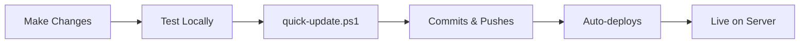

# 📋 Quick Reference - Trust Quality Designs

**Last Updated:** February 14, 2026

---

## 🌐 Live URLs

| Environment | URL |
|-------------|-----|
| **Demo/Production** | http://46.225.69.136 |
| **Local Development** | http://localhost:3000 |

---

## 🔑 Server Access

| Item | Value |
|------|-------|
| **IP Address** | 46.225.69.136 |
| **SSH** | `ssh root@46.225.69.136` |
| **Password** | mHTdiNaRtCFa |
| **App Directory** | `/var/www/tqd` |

---

## 🚀 Common Commands

### Development
```bash
npm run dev          # Start dev server (localhost:3000)
npm run build        # Build for production
npm run start        # Start production server
npm run lint         # Run ESLint
npm run typecheck    # Check TypeScript types
```

### Deployment (Windows)
```powershell
.\deployment\quick-update.ps1    # Commit + Push + Deploy (DAILY USE)
.\deployment\quick-deploy.ps1    # Deploy only
.\deployment\github-init.ps1     # First time GitHub setup
```

### Git Workflow
```bash
git status                       # Check changes
git add .                        # Stage all changes
git commit -m "message"          # Commit
git push origin main             # Push to GitHub
git pull origin main             # Pull latest changes
git log --oneline                # View history
```

### Server Management
```bash
# SSH to server
ssh root@46.225.69.136

# PM2 commands
pm2 status                       # Check app status
pm2 logs tqd-website             # View logs
pm2 restart tqd-website          # Restart app
pm2 monit                        # Monitor resources

# Nginx commands
systemctl status nginx           # Check Nginx status
nginx -t                         # Test config
systemctl reload nginx           # Reload Nginx

# System
df -h                           # Disk space
free -m                         # Memory usage
ufw status                      # Firewall status
```

---

## 📂 Project Structure

```
tqd/
├── src/
│   ├── app/                    # Next.js pages
│   │   ├── page.tsx           # Homepage
│   │   ├── about/             # About page
│   │   ├── services/          # Services
│   │   ├── work/              # Portfolio
│   │   ├── team/              # Team
│   │   ├── contact/           # Contact
│   │   ├── blog/              # Blog
│   │   └── api/               # API routes
│   ├── components/            # React components
│   │   ├── Header.tsx         # Navigation
│   │   ├── Hero.tsx           # Hero section
│   │   ├── Footer.tsx         # Footer
│   │   ├── GyroscopeTilt.tsx  # Mobile tilt
│   │   └── ShakeToClick.tsx   # Shake feature
│   ├── types/                 # TypeScript types
│   └── utils/                 # Utilities
├── public/                    # Static files
├── deployment/                # Deployment scripts
│   ├── quick-update.ps1      # ⚡⚡ Daily workflow
│   ├── quick-deploy.ps1      # ⚡ Deploy only
│   ├── github-init.ps1       # 🐙 GitHub setup
│   └── ...
├── README.md                  # Project overview
├── DEPLOYMENT_SUMMARY.md      # Deployment details
├── GITHUB_SETUP.md            # Git workflow
├── CHANGELOG.md               # Version history
└── package.json               # Dependencies
```

---

## 🎨 Design System

### Colors
```css
Backgrounds:
- gray-950 (#030712)
- red-950 (#450a0a)
- black (#000000)

Accents:
- red-400 (#f87171)
- red-300 (#fca5a5)
- red-200 (#fecaca)

Text:
- white (#ffffff)
- gray-300 (#d1d5db)
```

### Key Components
- **Header**: Morphing blob mobile menu
- **Hero**: CTA section with gradient
- **Cards**: Glassmorphism (red-900/40 to red-950/40)
- **Buttons**: Transparent outlined (border-white)
- **Forms**: Dark inputs (gray-900/50 bg)

---

## 📱 Mobile Features

### Gyroscope Tilt
```tsx
<GyroscopeTilt intensity={20}>
  
</GyroscopeTilt>
```
- Applied to case studies (intensity: 20)
- Applied to team photos (intensity: 15)
- iOS permission auto-request

### Shake to Click
- Floating toggle button (bottom-right)
- Threshold: 25 acceleration
- Cooldown: 500ms
- Visual & haptic feedback
- Auto-detects device compatibility

---

## 🐛 Troubleshooting

| Issue | Solution |
|-------|----------|
| **502 Bad Gateway** | `ssh root@46.225.69.136` → `pm2 restart tqd-website` |
| **Build fails** | `rm -rf .next node_modules && npm install && npm run build` |
| **Port 3000 in use** | `taskkill /F /IM node.exe` (Windows) |
| **Git conflicts** | `git pull --rebase origin main` |
| **PM2 not starting** | `cd /var/www/tqd && pm2 logs tqd-website` |

---

## 📞 Quick Links

| Resource | URL |
|----------|-----|
| **Live Site** | http://46.225.69.136 |
| **GitHub Repo** | https://github.com/arlantaan/trustqualitydesigns |
| **Next.js Docs** | https://nextjs.org/docs |
| **Tailwind Docs** | https://tailwindcss.com/docs |
| **Framer Motion** | https://www.framer.com/motion/ |

---

## 📚 Documentation Files

| File | Purpose |
|------|---------|
| `README.md` | 📖 Complete project overview |
| `DEPLOYMENT_SUMMARY.md` | 🚀 Full deployment details |
| `GITHUB_SETUP.md` | 🐙 Git workflow guide |
| `CHANGELOG.md` | 📝 Version history |
| `deployment/README.md` | ⚡ Quick deployment guide |
| `deployment/DEPLOYMENT.md` | 📋 Comprehensive deploy docs |
| `QUICK_REFERENCE.md` | ⚡ This file |

---

## ✅ Daily Workflow



**Simple Steps:**
1. Make your code changes
2. Run `npm run dev` to test locally
3. Run `.\deployment\quick-update.ps1`
4. Follow prompts to commit
5. Script auto-pushes to GitHub
6. Script auto-deploys to server
7. Done! ✅

---

## 🔐 Security Reminders

- ✅ Root password changed
- ✅ Firewall enabled (UFW)
- ✅ Only necessary ports open
- ⏳ TODO: Setup SSH keys
- ⏳ TODO: Create non-root user
- ⏳ TODO: Install fail2ban
- ⏳ TODO: Setup SSL certificate

---

## 📊 Key Metrics

| Metric | Value |
|--------|-------|
| **Node Version** | 20.20.0 |
| **Next.js Version** | 15.1.6 |
| **React Version** | 19.0.0 |
| **Pages** | 8 static + 6 API routes |
| **Build Size** | ~160KB main bundle |
| **Dependencies** | 368 packages |

---

## 🎯 Support

**For issues:**
1. Check this quick reference
2. Review deployment logs: `pm2 logs tqd-website`
3. Check Nginx logs: `tail -f /var/log/nginx/error.log`
4. Review full documentation in README.md

---

**Version:** 1.0.0  
**Status:** ✅ Production Ready  
**Deployed:** February 14, 2026
